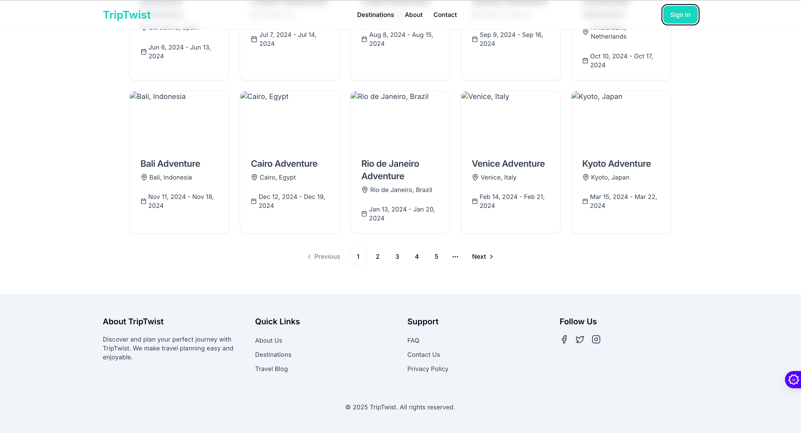
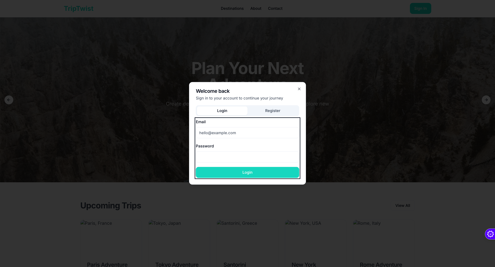
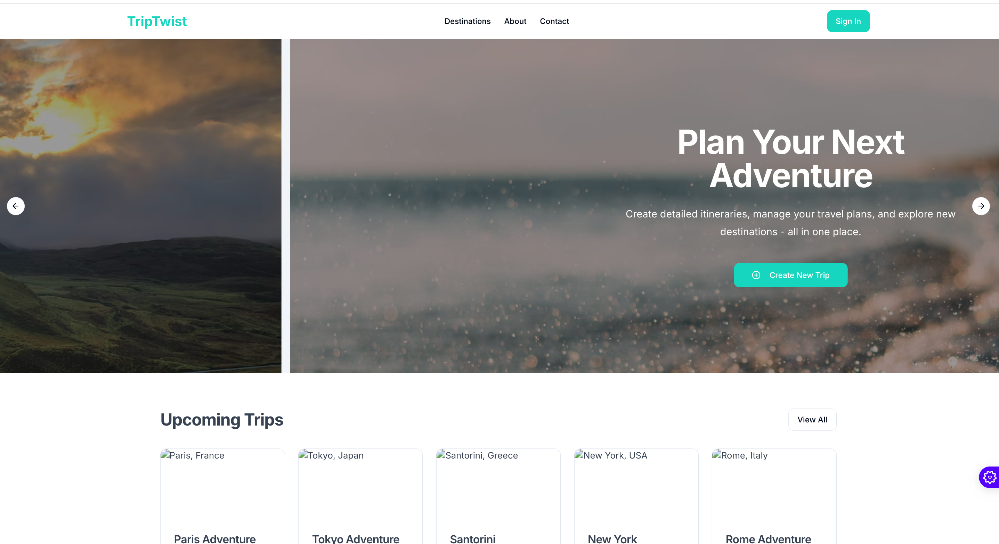

# TripTwist 🌍✈️

> Your ultimate travel companion for creating unforgettable journeys

)

## 🌟 Overview

TripTwist is a modern travel planning platform that helps adventurers create detailed itineraries, discover exciting destinations, and manage their travel plans efficiently. Built with cutting-edge technologies, it offers a seamless and enjoyable experience for both casual travelers and seasoned globetrotters.

## ✨ Features

### Smart Trip Planning

- Intuitive itinerary creation
- Destination discovery
- Real-time travel updates
- Offline access to trip details

### User-Friendly Interface
)
- Clean and modern design
- Responsive across all devices
- Easy navigation
- Personalized user experience

### Social Integration
)
- Share your trips with friends
- Connect with fellow travelers
- Follow favorite destinations
- Integrated social media sharing

## 🚀 Getting Started

### Prerequisites

- Node.js (v14 or higher)
- npm or yarn package manager

### Installation

1. Clone the repository
```bash
git clone https://github.com/yourusername/triptwist.git
```

2. Navigate to the project directory
```bash
cd triptwist
```

3. Install dependencies
```bash
npm install
```

4. Start the development server
```bash
npm run dev
```

## 🛠️ Tech Stack

- **Frontend Framework**: React with TypeScript
- **Styling**: Tailwind CSS
- **UI Components**: shadcn/ui
- **Build Tool**: Vite

## 📱 Screenshots

### Home Page


### Trip Planning Interface


### User Dashboard


## 🤝 Contributing

We love contributions! Here's how you can help:

1. Fork the repository
2. Create your feature branch (`git checkout -b feature/AmazingFeature`)
3. Commit your changes (`git commit -m 'Add some AmazingFeature'`)
4. Push to the branch (`git push origin feature/AmazingFeature`)
5. Open a Pull Request

## 📝 License

This project is licensed under the MIT License - see the [LICENSE](LICENSE) file for details.

## 🌐 Links

- [Website](https://triptwist.com)
- [Documentation](https://docs.triptwist.com)
- [Bug Report](https://github.com/yourusername/triptwist/issues)

## 💖 Support

If you find this project helpful, please give it a ⭐️!

## 📞 Contact

Have questions? Reach out to us:
- Email: support@triptwist.com
- Twitter: [@TripTwist](https://twitter.com/triptwist)
- Discord: [Join our community](https://discord.gg/triptwist)

---

Made with ❤️ by the TripTwist Team
